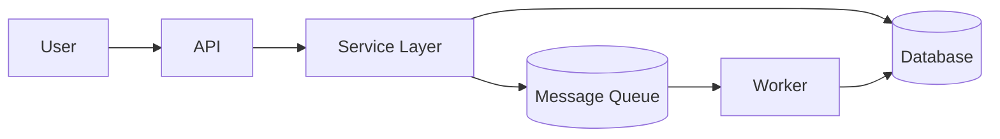
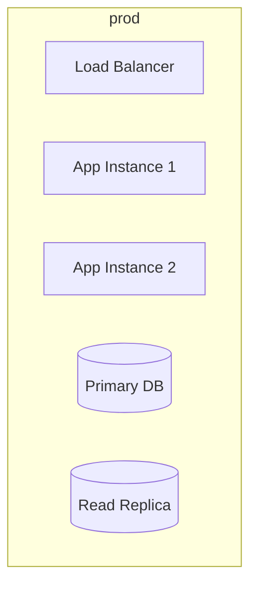

# Architecture

## What this system does (one paragraph)

<plain-language description; no jargon>

## System diagram

## Components

| Component | Responsibility | Runtime | Owner |
| --- | --- | --- | --- |

## Data flow (happy path)

1. <step>
2. <step>
3. <step>

## External dependencies

| System | Purpose | Protocol | Failure mode |
| --- | --- | --- | --- |

## Data stores

| Store | Schema location | Backup policy | Retention |
| --- | --- | --- | --- |

## Deployment topology

## Trust boundaries

- <internal vs external>
- <admin vs user>
- <what crosses each boundary>

## Performance characteristics

| Metric | Target | Current |
| --- | --- | --- |
| p50 latency | <ms> | <ms> |
| p99 latency | <ms> | <ms> |
| Throughput | <rps> | <rps> |

## Known limitations

- <limitation>: <why it exists, what it would take to fix>

## References

- ADRs: `docs/adr/`
- Runbook: `docs/RUNBOOK.md`
- Glossary: `docs/GLOSSARY.md`
